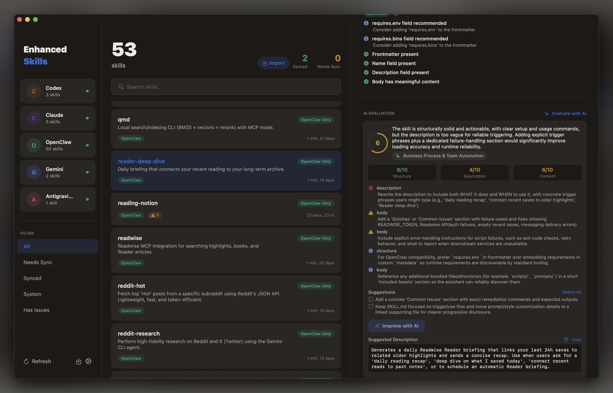

# EnhancedSkills

**A native macOS skill manager with AI-powered evaluation, provider-specific validation, and one-click fixes.**

  



---

## Why EnhancedSkills

- **AI evaluation** — Every skill is scored on structure, description quality, and content. The app suggests concrete improvements and can rewrite descriptions automatically.
- **Validation + auto-fix** — Provider-specific guideline violations are surfaced by severity. Most issues fix in one click, individually or in bulk.
- **GitHub import** — Discover and import skills directly from any GitHub repository. No manual cloning required.
- **Visual management** — A premium three-column layout with per-provider color coding gives you a clear picture of your entire skill library at a glance.

---

## Features

### AI Skill Evaluation
EnhancedSkills scores each skill on structure, description quality, and content using AI. Scores are shown inline, and the app surfaces specific suggestions for improvement — including the ability to have descriptions rewritten automatically.

### Validation & Auto-Fix
Every skill is validated against provider-specific guidelines. Violations are surfaced by severity (error, warning, suggestion) with fix hints. Most issues can be fixed automatically — individually or in bulk — directly from the UI.

### GitHub Import
Discover and import skills from any GitHub repository. Paste a repo URL and EnhancedSkills fetches and previews available skills before importing — no `git clone` required.

### Multi-Provider Skill Discovery
EnhancedSkills scans all configured skill directories and merges them into a unified library. Each skill is tracked across every provider so you always know what's where.

### Sync Status at a Glance
Skills are grouped by sync state — **Synced** (present in multiple providers), **Needs Sync** (only in one), **System**, and **Has Issues**. The sidebar shows live provider health indicators and skill counts.

### Manual Transfer with Preview
Copy any skill to another provider with a full transfer preview before anything is written. The app shows source/destination paths and file counts, and asks for confirmation if a skill already exists at the destination.

### Filtering & Search
Filter by sync status, provider, or validation issues. Search by skill name or description. Click any provider card in the sidebar to instantly scope the list to that provider's skills.

### Context Menus
Right-click any skill to reveal it in Finder, copy it to a specific provider, or batch-fix all validation issues for a given provider.

### Auto-Updates
EnhancedSkills checks for updates on launch and via **EnhancedSkills → Check for Updates…**. Updates are downloaded and installed in-place — no App Store required.

---

## Supported Providers

| Provider | Default Path |
|---|---|
| Codex | `~/.codex/skills` |
| Claude | `~/.claude/skills` |
| OpenClaw | *(configure manually)* |
| Gemini | `~/.gemini/skills` *(disabled by default)* |
| Antigravity | `~/.gemini/skills` *(disabled by default)* |

Gemini and Antigravity can be enabled in **Settings** (`⌘,`).

---

## Installation

1. Download the latest `EnhancedSkills.dmg` from the [Releases](https://github.com/sameerbajaj/EnhancedSkills/releases) page.
2. Open the DMG and drag **EnhancedSkills.app** to your Applications folder.
3. Launch the app.

The app is signed and notarized with Apple. It will open without any Gatekeeper warnings.

---

## Auto-Updates

EnhancedSkills uses a rolling release model built on GitHub Releases:

- **Stable releases** are tagged (e.g. `v1.2.0`) and published as full releases.
- **Rolling builds** are published automatically on every push to `main` under the `latest` pre-release tag.

The app checks GitHub on launch and notifies you when a newer version is available. You can install immediately or defer. Updates are downloaded as a DMG, mounted, and applied in-place — the app relaunches automatically after installation.

To check manually: **EnhancedSkills → Check for Updates…**

---

## Building from Source

Requirements: macOS 14+, Xcode 15+

```bash
git clone https://github.com/sameerbajaj/EnhancedSkills.git
cd EnhancedSkills
open EnhancedSkills.xcodeproj
```

Select the **EnhancedSkills** scheme and press **⌘R** to build and run.

No external dependencies — the project uses only built-in Apple frameworks.
