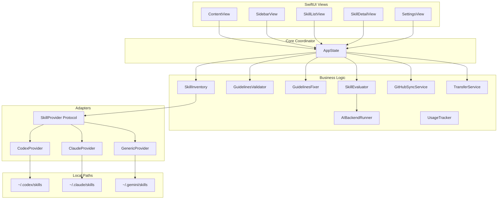

# EnhancedSkills - Developer & AI Agent Guide

Welcome to the `EnhancedSkills` repository! This document outlines the project architecture, data flow, design system, key components, and coding guidelines. AI agents (like Antigravity and Claude) should read this file before making modifications or additions to the codebase.

---

## 1. Project Overview
`EnhancedSkills` is a native macOS Swift/SwiftUI application designed to manage, validate, evaluate, and sync developer "skills". 

### What is a "Skill"?
In this context, a **Skill** is a local directory containing a `SKILL.md` markdown file (usually with YAML frontmatter containing metadata such as the skill name, description, tools, model, etc.), along with optional subdirectories:
- `scripts/`: Executable helper scripts.
- `references/`: Reference markdown documentation or files.

### Supported Providers
The app scans, parses, and synchronizes skills across multiple local developer environments (referred to as **Providers**):
1. **Codex**: Default path `~/.codex/skills`
2. **Claude**: Default path `~/.claude/skills`
3. **OpenClaw**: Configured manually (e.g. `~/.clawhub` or customized)
4. **Gemini**: Default path `~/.gemini/skills` (disabled by default, toggleable in Settings)
5. **Antigravity**: Default path `~/.gemini/antigravity/skills` (disabled by default, toggleable in Settings)

---

## 2. Architecture & Data Flow

Below is the layout of the application's components and their relationships:



---

## 3. Directory Structure Map

The repository is structured as a standard Swift Xcode project:

*   **`plan.md`**: The implementation roadmap for major feature versions.
*   **`README.md`**: General project details, features, and setup instructions.
*   **`EnhancedSkills.xcodeproj`**: Xcode project file.
*   **`EnhancedSkills/`**: Main Swift source folder.
    *   **`App/`**:
        *   [`AppState.swift`](file:///Users/sameerbajaj/PARA/Projects/dev/EnhancedSkills/EnhancedSkills/App/AppState.swift): Coordinates app launch, background threads, filtering/searching/sorting, and active modal sheets.
    *   **`Models/`**:
        *   [`Provider.swift`](file:///Users/sameerbajaj/PARA/Projects/dev/EnhancedSkills/EnhancedSkills/Models/Provider.swift): Enumeration of supported AI coding tool providers (e.g. `.claude`, `.codex`) and their schemas/specifications.
        *   [`DiscoveredSkill.swift`](file:///Users/sameerbajaj/PARA/Projects/dev/EnhancedSkills/EnhancedSkills/Models/DiscoveredSkill.swift): Properties for a single parsed skill folder from a specific provider.
        *   [`SkillRecord.swift`](file:///Users/sameerbajaj/PARA/Projects/dev/EnhancedSkills/EnhancedSkills/Models/SkillRecord.swift): Aggregated model merging duplicate skills across providers (using folder names as the canonical slug).
        *   [`AIEvaluation.swift`](file:///Users/sameerbajaj/PARA/Projects/dev/EnhancedSkills/EnhancedSkills/Models/AIEvaluation.swift): Data model representing AI evaluation scores (structure, content, description).
        *   [`GuidelineValidation.swift`](file:///Users/sameerbajaj/PARA/Projects/dev/EnhancedSkills/EnhancedSkills/Models/GuidelineValidation.swift): Defines rule severities (`error`, `warning`, `suggestion`).
        *   [`GitHubOrigin.swift`](file:///Users/sameerbajaj/PARA/Projects/dev/EnhancedSkills/EnhancedSkills/Models/GitHubOrigin.swift): Represents upstream repo links, commit SHAs, and sync status.
    *   **`Providers/`**:
        *   [`SkillProvider.swift`](file:///Users/sameerbajaj/PARA/Projects/dev/EnhancedSkills/EnhancedSkills/Providers/SkillProvider.swift): Core protocol requiring `discoverSkills()` implementation.
        *   [`ClaudeProvider.swift`](file:///Users/sameerbajaj/PARA/Projects/dev/EnhancedSkills/EnhancedSkills/Providers/ClaudeProvider.swift), [`CodexProvider.swift`](file:///Users/sameerbajaj/PARA/Projects/dev/EnhancedSkills/EnhancedSkills/Providers/CodexProvider.swift), [`GenericProvider.swift`](file:///Users/sameerbajaj/PARA/Projects/dev/EnhancedSkills/EnhancedSkills/Providers/GenericProvider.swift): Concrete implementations mapping files in the respective provider directories.
    *   **`Services/`**:
        *   [`GuidelinesValidator.swift`](file:///Users/sameerbajaj/PARA/Projects/dev/EnhancedSkills/EnhancedSkills/Services/GuidelinesValidator.swift): Validates skills against provider requirements (e.g. required YAML fields, length limits, forbidden XML, size checks).
        *   [`GuidelinesFixer.swift`](file:///Users/sameerbajaj/PARA/Projects/dev/EnhancedSkills/EnhancedSkills/Services/GuidelinesFixer.swift): Rewrites `SKILL.md` to automatically fix simple infractions.
        *   [`SkillEvaluator.swift`](file:///Users/sameerbajaj/PARA/Projects/dev/EnhancedSkills/EnhancedSkills/Services/SkillEvaluator.swift): Scores quality metrics using model API runners.
        *   [`AIBackendRunner.swift`](file:///Users/sameerbajaj/PARA/Projects/dev/EnhancedSkills/EnhancedSkills/Services/AIBackendRunner.swift): Low-level LLM runner for AI tasks.
        *   [`TransferService.swift`](file:///Users/sameerbajaj/PARA/Projects/dev/EnhancedSkills/EnhancedSkills/Services/TransferService.swift): Moves or duplicates folders recursively between provider root paths.
        *   [`GitHubSyncService.swift`](file:///Users/sameerbajaj/PARA/Projects/dev/EnhancedSkills/EnhancedSkills/Services/GitHubSyncService.swift) & [`GitHubImportService.swift`](file:///Users/sameerbajaj/PARA/Projects/dev/EnhancedSkills/EnhancedSkills/Services/GitHubImportService.swift): Manage connections, import branches, and push edits back to remote repos via `gh` CLI.
        *   [`UsageTracker.swift`](file:///Users/sameerbajaj/PARA/Projects/dev/EnhancedSkills/EnhancedSkills/Services/UsageTracker.swift): Tracks local executions or actions.
        *   [`SettingsStore.swift`](file:///Users/sameerbajaj/PARA/Projects/dev/EnhancedSkills/EnhancedSkills/Services/SettingsStore.swift): Handles application-wide user preferences using macOS `UserDefaults`.
    *   **`Views/`**:
        *   [`SidebarView.swift`](file:///Users/sameerbajaj/PARA/Projects/dev/EnhancedSkills/EnhancedSkills/Views/SidebarView.swift): Renders filters, active sync tags, and overall provider health.
        *   [`SkillListView.swift`](file:///Users/sameerbajaj/PARA/Projects/dev/EnhancedSkills/EnhancedSkills/Views/SkillListView.swift): Full search and sortable panel representing individual skill cards.
        *   [`SkillDetailView.swift`](file:///Users/sameerbajaj/PARA/Projects/dev/EnhancedSkills/EnhancedSkills/Views/SkillDetailView.swift): Displays YAML attributes, scores, warnings, and file paths. Allows copying, fixing, and updating skills.
        *   [`SettingsView.swift`](file:///Users/sameerbajaj/PARA/Projects/dev/EnhancedSkills/EnhancedSkills/Views/SettingsView.swift): Toggle providers, adjust API keys, and configure directory paths.
        *   **`Onboarding/`**: Welcome screens introducing basic providers and configurations.
    *   **`DesignSystem/`**:
        *   [`DesignTokens.swift`](file:///Users/sameerbajaj/PARA/Projects/dev/EnhancedSkills/EnhancedSkills/DesignSystem/DesignTokens.swift): The central design system specifying colors (e.g. `DS.Color.canvas`, `DS.Color.surface`), spacing sizes (`DS.Spacing`), and corner radiuses (`DS.Radius`). Supports light and dark aqua modes automatically.

---

## 4. Key Workflows

### 4.1 Discovery & Merging
At startup or on refresh, `AppState` triggers `discoverSkills()` across all enabled providers.
1. The provider scans its root path and parses all immediate subfolders.
2. If `SKILL.md` exists, [`SkillParser.swift`](file:///Users/sameerbajaj/PARA/Projects/dev/EnhancedSkills/EnhancedSkills/Services/SkillParser.swift) extracts YAML metadata.
3. The parser calculates a SHA hash of the file contents to compare local changes and version shifts.
4. [`SkillInventory.swift`](file:///Users/sameerbajaj/PARA/Projects/dev/EnhancedSkills/EnhancedSkills/Services/SkillInventory.swift) normalizes folder names to a lowercase slug (e.g., `git-commit`) and merges duplicates into a unified `SkillRecord`.

### 4.2 Syncing & Duplicating
Users can manually copy a skill from one provider (e.g. Codex) to another (e.g. Claude).
1. `AppState` generates a `SkillTransferPlan` stating the source, target path, file count, and warning if the destination folder already contains data.
2. [`TransferConfirmationSheet.swift`](file:///Users/sameerbajaj/PARA/Projects/dev/EnhancedSkills/EnhancedSkills/Views/TransferConfirmationSheet.swift) appears.
3. Upon approval, [`TransferService.swift`](file:///Users/sameerbajaj/PARA/Projects/dev/EnhancedSkills/EnhancedSkills/Services/TransferService.swift) copies folders recursively, skipping `.DS_Store` and other metadata, then runs a full app refresh.

### 4.3 Guidelines & Fixing
1. The [`GuidelinesValidator`](file:///Users/sameerbajaj/PARA/Projects/dev/EnhancedSkills/EnhancedSkills/Services/GuidelinesValidator.swift) reviews each file during discovery.
2. If problems are found (like missing fields or invalid characters), they are categorized as `.error`, `.warning`, or `.suggestion`.
3. Auto-fixable rules (e.g., inserting missing frontmatter delimiters or inserting missing keys with empty strings) can be corrected instantly using [`GuidelinesFixer`](file:///Users/sameerbajaj/PARA/Projects/dev/EnhancedSkills/EnhancedSkills/Services/GuidelinesFixer.swift).

---

## 5. Developer & AI Agent Guidelines

If you are modifying or extending `EnhancedSkills`, you **must** adhere to the following conventions:

### 5.1 SwiftUI & Architecture
*   **Observation Pattern**: Use the modern `@Observable` macro for shared state objects (like `AppState`). Avoid using deprecated `@StateObject` or `@ObservedObject` patterns unless referencing legacy frameworks.
*   **Concurrency**: Always perform file operations and API requests on asynchronous tasks (`Task`, `async/await`). Do not freeze the main threat/UI thread.
*   **Decoupled Side-Effects**: SwiftUI Views should not perform disk writes or remote networking calls directly. Invoke these operations through methods on `AppState`, which coordinates with the relevant service.

### 5.2 Local Path Resolution
*   **NEVER hardcode home directories** (e.g., `/Users/sameerbajaj/`).
*   Always resolve paths relative to the current user home directory:
    ```swift
    let home = FileManager.default.homeDirectoryForCurrentUser
    let codexPath = home.appendingPathComponent(".codex/skills")
    ```
*   Use security-scoped bookmarks or appropriate helper configurations where necessary.

### 5.3 Design System & Theme
The application adheres to a premium, editorial-light design theme with an off-white warm background and sleek dark-mode compatibility.
*   Use spacing elements directly from the design system: `DS.Spacing.md`, `DS.Spacing.lg`, etc.
*   Use color constants from `DS.Color` instead of generic `Color.red` or `Color.blue`. For instance:
    *   Canvas Background: `DS.Color.canvas`
    *   Card Surface: `DS.Color.surface`
    *   Text (Adaptive Primary): `DS.Color.text`
    *   Text (Adaptive Secondary): `DS.Color.textSecondary`
*   Add micro-interactions and transitions where possible when items sync or update.

### 5.4 Test Strategy
*   Ensure that any new parsing or validation rule is covered by unit tests in `EnhancedSkillsTests`.
*   Run the test scheme inside Xcode (`⌘U`) to verify no regressions have occurred.
